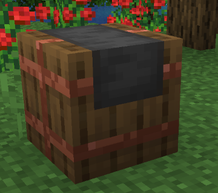
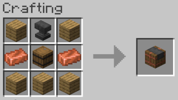

# Arcane Infusion Table

The Arcane Infusion Table is a specialized enchanting station that channels the power of codices to imbue ordinary items with magic.
By placing a set of enchanting codices upon its surface, the table draws upon their stored spells and transfers their power into a chosen item.
Each Codex offers a unique enchantment, and the table’s delicate ritual ensures that the item receives the precise magic intended, whether it’s protection, enhancement, or a specialized ability

## Recipe

## Usage

| Key | Description                                                                              |
|-----|------------------------------------------------------------------------------------------|
| 1   | Multiple Codex of Enchantments containing the enchantments you want to apply to the item |
| 2   | Item to be enchanted                                                                     |
| 3   | Enchanted Item                                                                           |

For each enchantment applied to the Enchanted Item, the Infusion table will:
* Consume one Codex containing the enchantment applied.
* Consume an experience cost proportional to the level of the enchantment.

The codices & experience will be paid when the enchanted item is removed from Slot #3.
This allows you to play with the set of enchantments that you want to apply.
Only those enchantments that can be applied to the item will figure in the cost calculation.