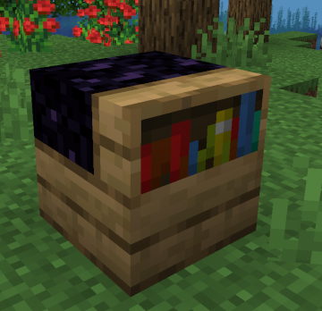
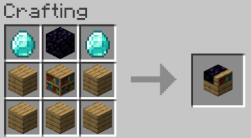
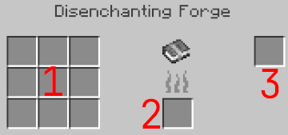

# Disenchanting Forge

A Disenchanting Forge is a mystical crafting device designed for the creation of magical [Parchment](parchment).
Infused with the essence of Disenchantment Powder, this forge harnesses the power to strip away the magic from enchanted books, leaving behind nothing but pure, untainted [Parchments](parchment).
When an enchanted book is placed into the forge, the forge channels the powder's energy, dissolving its enchantments and transforming the residual magical essence into a [Parchment](parchment) ready to be inscribed.
The process is delicate, and only the most skilled artisans can control the Forge's volatile energy, ensuring that the [Parchment](parchment)s produced are free of external magic and perfect for future imbuing of enchantments.

## Recipe

## Usage

| Key | Description                                                                                                                    |
|-----|--------------------------------------------------------------------------------------------------------------------------------|
| 1   | Enchanted Books or [Codex of Enchantment](codex-of-enchantment)   Warning: Any books put here will be DESTROYED |
| 2   | [Powder of Disenchantment](powder-of-disenchantment)                                                                                                      |
| 3   | [Parchment](parchment)                                                                                                                      |

For each enchantment contained in the destroyed book, the Forge will:
* Consume 1 [Powder of Disenchantment](powder-of-disenchantment).
* Produce 1 [Parchment](parchment).