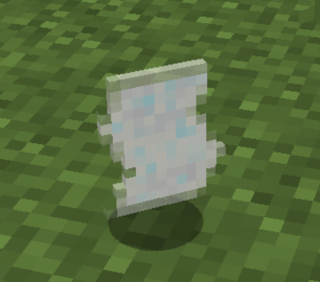

# Parchment

A page of Parchment is created through the ancient and delicate art of erasing an existing enchantment from an enchanted book.
Once part of a powerful magical book, its enchantments were meticulously removed, leaving behind only the bare, untainted Parchment.
This process has imbued the Parchment with a unique power: it can absorb and contain a single magic enchantment.

## Recipe
See [Disenchanting Forge](disenchanting-forge)