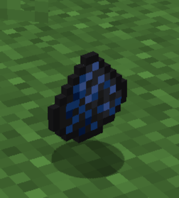
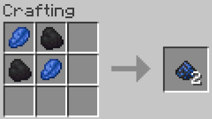

# Powder of Disenchantment

The Powder of Disenchantment is a mystical substance crafted from the union of coal and lapis lazuli.
This dark blue powder holds the unique power to dissolve enchantments, and magical bindings.
The combination of coal’s grounding properties and lapis’s deep connection to magic makes this powder a potent tool for those seeking to break the hold of enchantments.

## Recipe
