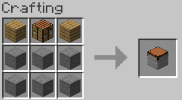
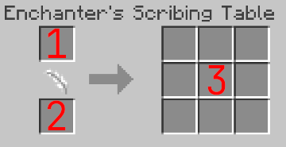

# Enchanter’s Scribing Table

The Enchanter’s Scribing Table is a magical workstation designed to extract enchantments from items and imprint them into blank tomes.
Using an array of runes and arcane symbols, the table channels the essence of an enchanted object and transfers its magic into the waiting tome, creating a new repository of power.
This process preserves the enchantment's potency, allowing the tome to serve as a portable vessel of magic, ready to be placed onto a new item.

## Recipe

## Usage

| Key | Description                                                                                                                                 |
|-----|---------------------------------------------------------------------------------------------------------------------------------------------|
| 1   | Enchanted Item (Armor / Weapon / Tool / etc) Note: The tool will be returned in the same state, but without any enchantments remaining. |
| 2   | Parchment                                                                                                                                   |
| 3   | Codex of Enchantment                                                                                                                        |

For each enchantment on the Enchanted Item, the Scribing table will:
* Consume 1 Parchment.
* Produce 1 Code of Enchantment.

## Notes
v 1.0.0 - The Enchanter's Scribing Table will only process items with a maximum of 8 enchantments.